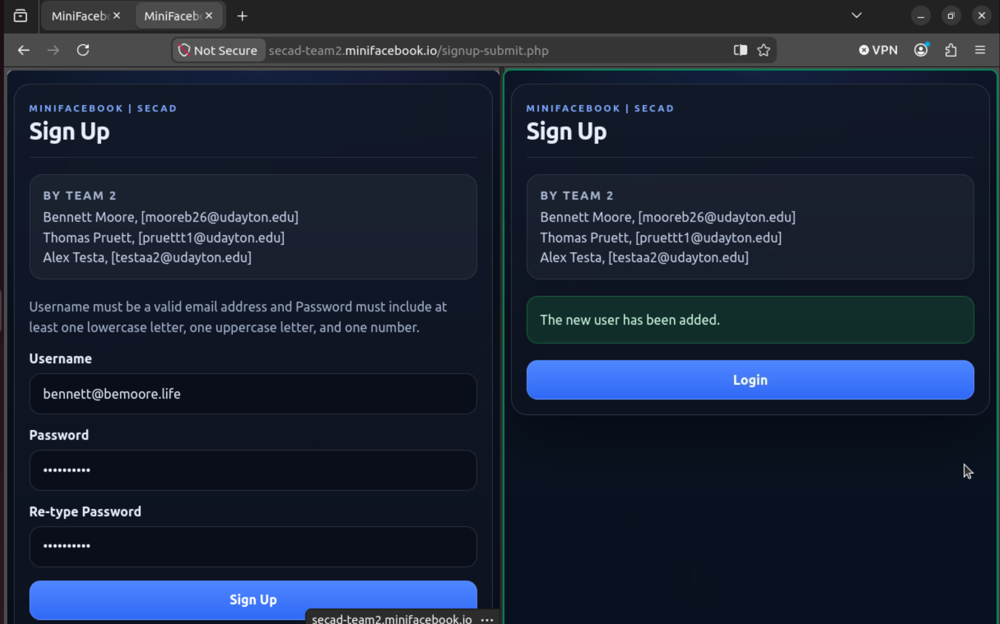
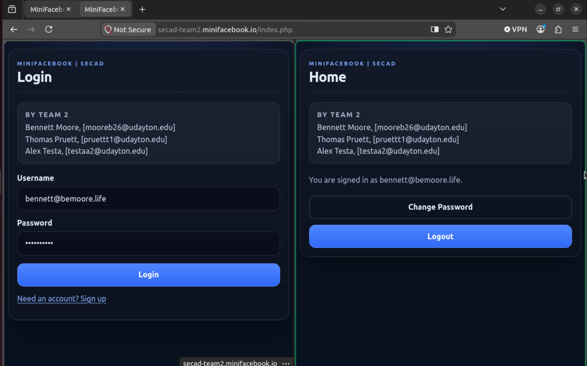
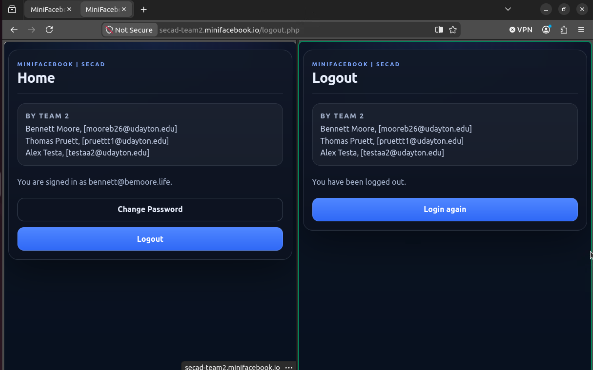
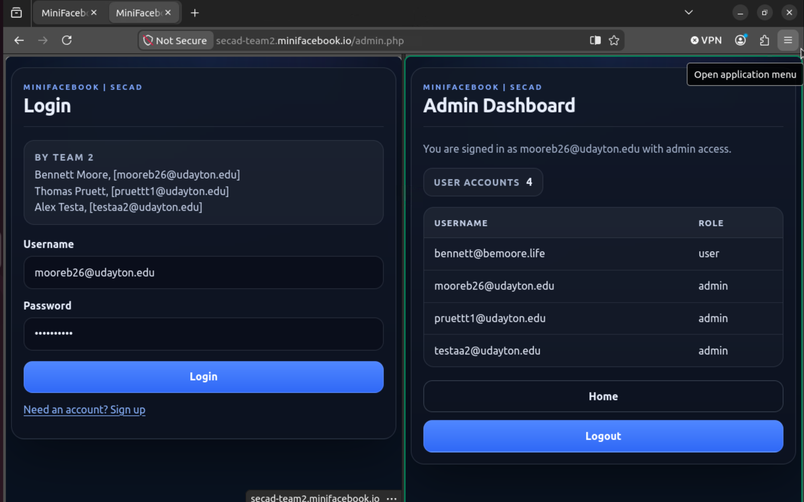
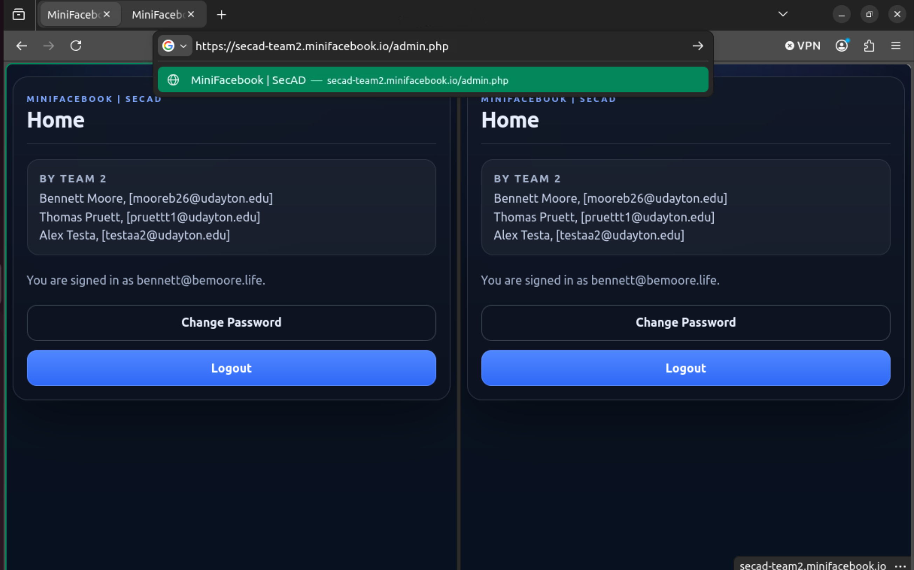
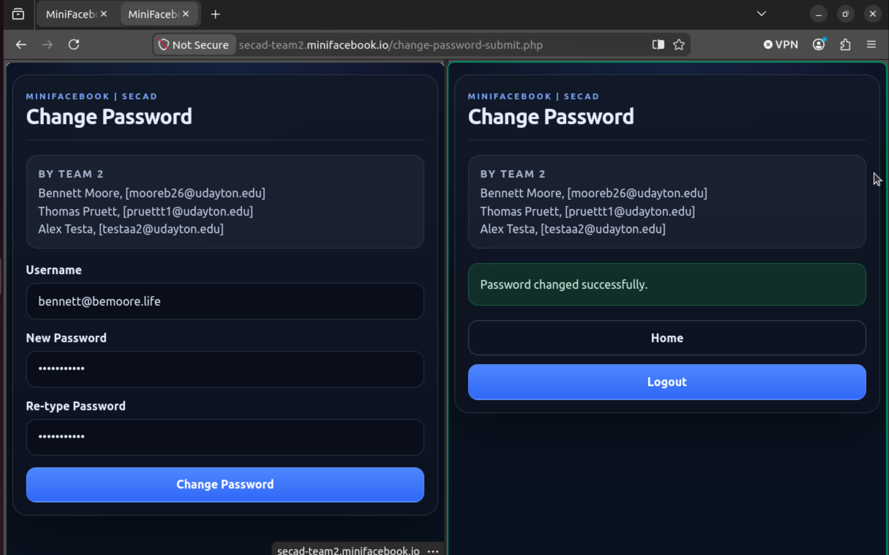
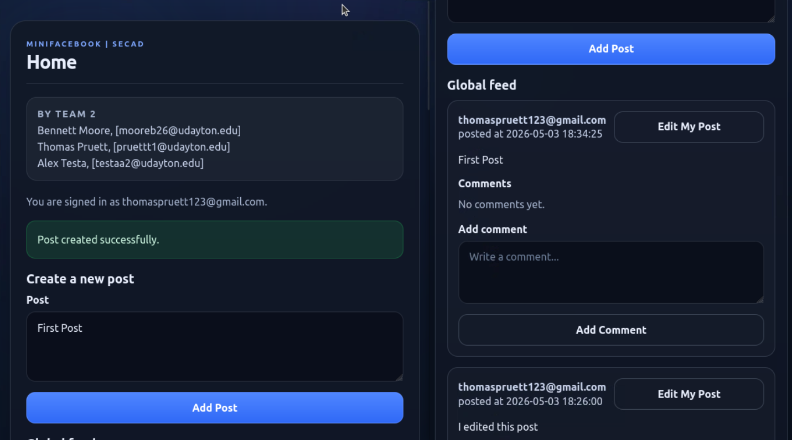
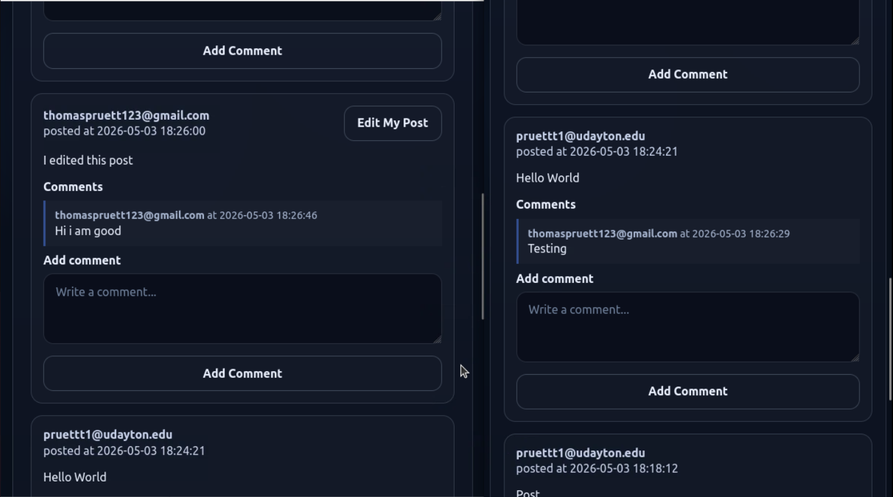
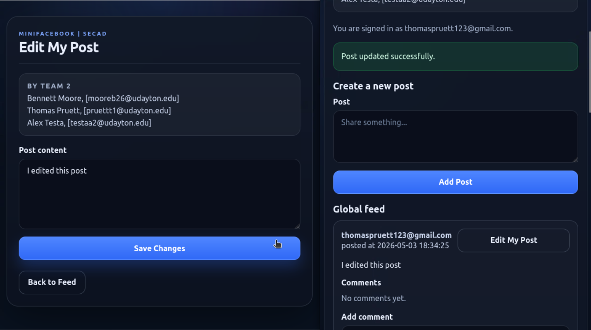

### CPS 475/575 Secure Application Development

# MiniFacebook Project Report

## Course Information

- Instructor: Phu Phung
- Repository URL: `git@bitbucket.org:secad-sp26-team2/secad-teamproject.git`
- Video demo 1 URL: https://drive.google.com/file/d/196_iwXlICQvz8u4ZHnwGI55DLeql_HKP/view?usp=drive_link
- Video demo 2 URL: https://drive.google.com/file/d/1Zucc3XEYVU-TxYOlth76xWCL1e_myWQU/view?usp=drive_link

## Team Members

- Bennett Moore, [mooreb26@udayton.edu](mailto:mooreb26@udayton.edu)
- Alex Testa, [testaa2@udayton.edu](mailto:testaa2@udayton.edu)
- Thomas Pruett, [pruettt1@udayton.edu](mailto:pruettt1@udayton.edu)

# 1. Introduction

MiniFacebook is a small PHP and MySQL web application built for CPS 475/575 Secure Application Development. The project is deployed through Apache over HTTPS and is organized as a simple public site with shared PHP helpers under `src/`.

The current application includes:

- Authentication pages for login and logout
- Registration for new users
- A password change flow for authenticated users
- A role-based admin page that shows the user list
- Shared session and credential validation helpers
- Authenticated user posting and commenting

The repository also includes scripts for local setup and deployment:

- `scripts/setup.sh` installs the required packages and Apache SSL configuration
- `db/init.sh` loads the database schema and seed data
- `scripts/deploy.sh` copies the app into the Apache document root

## 2. Design

### Database

- Database name: `secad_minifacebook`
- First table: `users`
- Columns: `username`, `password`, and `role`
- `username` is the primary key
- `role` is constrained to `user` or `admin`
- Seed data is defined in `db/init.sql`
- The current implementation stores passwords with MySQL `md5()`
- Seeded accounts use `admin` so the admin path can be tested immediately
- New registrations are created with the `user` role
- Second table: `posts`
- `id` is the primary key
- Timestamped for time created and lasted edited
- The ability to edit and delete a post is constrained to the username of the author
- Third table: `comments`
- `id` is the primary key
- Timestamped at creation

### User Interface

- The UI is server-rendered with PHP and styled with `public/styles.css`
- `public/login.php` provides the login form
- `public/signup.php` provides the registration form
- `public/change-password.php` provides the password change form
- `public/index.php` is the authenticated home page for regular users
- `public/admin.php` is the admin-only dashboard
- `public/logout.php` ends the session and returns the user to login
- `public/add-post-submit.php` allows users to submit original posts for display
- `public/add-comment-submit.php` allows users to comment on displayed posts
- `public/edit-post.php` is the page allowing users to edit their posts
- `public/edit-post-submit.php` allows users to submit for dispaly edited posts
- The layout uses a shared page wrapper in `src/page_header.php`
- The design is intentionally simple and responsive rather than framework-driven

### Functionality

- Unauthenticated users are redirected to `public/login.php`
- Authentication is session-based and enforced through `src/session_auth.php`
- The current user role is stored in the session after a successful login
- Admin logins are routed to `public/admin.php`
- Regular users are routed to `public/index.php`
- `require_admin_session()` blocks non-admin access to the admin page
- Registration creates only regular users
- Password changes require an authenticated session
- Posting editing and commenting all require authenitcated sessions

## 3. Implementation & security analysis

### Security programming principles

- Credential rules are centralized in `src/credential_validation.php` so login, signup, and password change use the same validation logic
- Server-side validation is used even though the forms also include HTML validation attributes
- Database writes use prepared statements and bound parameters in `src/database.php`
- The login handler also uses a prepared statement when checking credentials
- Dynamic output is escaped with `htmlspecialchars()` in the pages that print usernames or roles

### Defense in depth

- Input validation blocks invalid credentials before they reach the database layer
- Prepared statements reduce SQL injection risk
- Session checks prevent unauthenticated access to protected pages
- Role checks separate admin-only content from regular-user content
- The session cookie is configured as `secure` and `httponly`
- Login regenerates the session ID before marking the session authenticated
- Apache is configured for HTTPS in `conf/sites/secad-team-project-ssl.conf`

### Database security

- The application uses a dedicated MySQL account: `secad_team2_user`
- The application does not accept database credentials from user input
- The schema limits user roles to the expected RBAC values
- SQL statements that include user input use parameter binding
- The database access code is separated from the public page handlers

### Robustness and defensive behavior

- Invalid input is rejected early by shared validation helpers
- The app exits on database connection failure instead of continuing in a broken state
- Logout explicitly destroys the server session and browser cookie
- Session checks reject missing or tampered session state
- The session layer compares the stored browser user agent to the current request user agent to detect hijacking

### Known attack handling

- SQL Injection: mitigated with prepared statements and bound parameters
- XSS: mitigated by escaping dynamic output with `htmlspecialchars()` on the main public pages
- CSRF: there is no dedicated CSRF token system in the current implementation, so this remains a known gap
- Session Hijacking: mitigated by session regeneration, secure cookie flags, and user-agent checking

### Role separation

- Roles are stored in the database and copied into the session at login
- Seed data creates admin accounts
- New signups are always assigned the `user` role
- `require_admin_session()` allows admins through, redirects regular users to the normal home page, and rejects invalid roles

You can reuse the work and report from Lab 6.

## 4. Demo

A new user can sign up for an account at `/signup.php`:



A returning user can log in to your account at `/login.php`:



A user can log out from their account:



An admin can login to their account and will end up at `/admin.php`:



A regular user cannot access admin-only pages:



A user can change their password:



A user can add their own post



A user can comment on any post



A user can edit their own post




## 5. Appendix

This appendix includes the content of `db/init.sql` and every PHP source file in the project.

### `db/init.sql`

```sql
create database IF NOT EXISTS secad_minifacebook;
CREATE USER IF NOT EXISTS 'secad_team2_user'@'localhost' IDENTIFIED BY  'secad_team2_pw';
ALTER USER 'secad_team2_user'@'localhost' IDENTIFIED BY 'secad_team2_pw';
GRANT ALL ON secad_minifacebook.* TO 'secad_team2_user'@'localhost';
FLUSH PRIVILEGES;
USE secad_minifacebook;
drop table if exists users;
drop table if exists comments;
drop table if exists posts;
create table users(
  username varchar(50) PRIMARY KEY,
  password varchar(100) NOT NULL,
  role enum('user','admin') NOT NULL DEFAULT 'user');

create table posts(
  id int auto_increment primary key,
  username varchar(50) not null,
  body text not null,
  created_at timestamp not null default current_timestamp,
  updated_at timestamp not null default current_timestamp on update current_timestamp,
  constraint fk_posts_user foreign key (username) references users(username) on delete cascade
);

create table comments(
  id int auto_increment primary key,
  post_id int not null,
  username varchar(50) not null,
  body text not null,
  created_at timestamp not null default current_timestamp,
  constraint fk_comments_post foreign key (post_id) references posts(id) on delete cascade,
  constraint fk_comments_user foreign key (username) references users(username) on delete cascade
);

create index idx_posts_created_at on posts(created_at);
create index idx_comments_post_created on comments(post_id, created_at);
-- Seed accounts use email-style usernames to match the auth form validation.
-- All seeded users are admins so the RBAC path can be tested immediately.
INSERT INTO users(username,password,role) VALUES ('pruettt1@udayton.edu',md5('Tommy123'),'admin');
INSERT INTO users(username,password,role) VALUES ('mooreb26@udayton.edu',md5('Bennett123'),'admin');
INSERT INTO users(username,password,role) VALUES ('testaa2@udayton.edu',md5('Alex123'),'admin');
```

### `public/admin.php`

```php
<?php
require_once __DIR__ . "/../src/database.php";
require_once __DIR__ . "/../src/session_auth.php";
require_once __DIR__ . "/../src/page_header.php";

require_admin_session();

$users = get_all_users();

render_page_header("Admin Dashboard", FALSE);
?>
	<p class="helper-text">You are signed in as <?php echo htmlspecialchars($_SESSION["username"], ENT_QUOTES, "UTF-8"); ?> with admin access.</p>

	<div class="admin-summary">
		<span class="admin-summary-label">User accounts</span>
		<span class="admin-summary-value">
			<?php
			if ($users === FALSE) {
				echo "Unavailable";
			} else {
				echo count($users);
			}
			?>
		</span>
	</div>

<?php if ($users === FALSE) : ?>
	<p class="status status-error">Error: unable to load the user list.</p>
<?php elseif (empty($users)) : ?>
	<p class="status">No user accounts were found.</p>
<?php else : ?>
	<div class="table-wrap">
		<table class="data-table">
			<thead>
				<tr>
					<th scope="col">Username</th>
					<th scope="col">Role</th>
				</tr>
			</thead>
			<tbody>
<?php foreach ($users as $user) : ?>
				<tr>
					<td><?php echo htmlspecialchars($user["username"], ENT_QUOTES, "UTF-8"); ?></td>
					<td><?php echo htmlspecialchars($user["role"], ENT_QUOTES, "UTF-8"); ?></td>
				</tr>
<?php endforeach; ?>
			</tbody>
		</table>
	</div>
<?php endif; ?>

	<div class="actions">
		<a class="button button-secondary" href="index.php">Home</a>
		<a class="button" href="logout.php">Logout</a>
	</div>
<?php render_page_footer(); ?>
```

### `public/change-password-submit.php`

```php
<?php
require_once __DIR__ . "/../src/database.php";
require_once __DIR__ . "/../src/credential_validation.php";
require_once __DIR__ . "/../src/session_auth.php";
require_once __DIR__ . "/../src/page_header.php";

require_authenticated_session();

list($username, $newpassword, $validation_error) = validate_credential_pair(
    isset($_POST["username"]) ? $_POST["username"] : null,
    isset($_POST["newpassword"]) ? $_POST["newpassword"] : null,
    isset($_POST["renewpassword"]) ? $_POST["renewpassword"] : null
);

if ($validation_error !== null) {
    render_page_header("Change Password");
    echo '<p class="status status-error">Error: ' . htmlspecialchars($validation_error, ENT_QUOTES, "UTF-8") . '</p>';
    echo '<div class="actions"><a class="button" href="change-password.php">Back to change password</a></div>';
    render_page_footer();
    exit();
}

render_page_header("Change Password");
if (changepassword($username, $newpassword)) {
    echo '<p class="status status-success">Password changed successfully.</p>';
} else {
    echo '<p class="status status-error">Error occurred while changing password.</p>';
}
?>

<div class="actions">
	<a class="button button-secondary" href="index.php">Home</a>
	<a class="button" href="logout.php">Logout</a>
</div>
<?php render_page_footer(); ?>
```

### `public/change-password.php`

```php
<?php
require_once __DIR__ . "/../src/session_auth.php";
require_once __DIR__ . "/../src/page_header.php";
require_once __DIR__ . "/../src/credential_validation.php";

require_authenticated_session();
render_page_header("Change Password");
?>
	<form action="change-password-submit.php" method="POST" class="form login">
		<div class="field">
			<label for="change-username">Username</label>
			<input
				id="change-username"
				type="text"
				class="text_field"
				name="username"
				required
				minlength="3"
				maxlength="50"
				pattern="<?php echo USERNAME_PATTERN; ?>"
				title="Please enter a valid email as username"
				placeholder="Your email address"
				onchange="this.setCustomValidity(this.validity.patternMismatch ? this.title : '')"
				autocomplete="username"
			/>
		</div>

		<div class="field">
			<label for="change-newpassword">New Password</label>
			<input
				id="change-newpassword"
				type="password"
				class="text_field"
				name="newpassword"
				required
				minlength="8"
				maxlength="100"
				pattern="<?php echo PASSWORD_HTML_PATTERN; ?>"
				title="<?php echo PASSWORD_REQUIREMENT_MESSAGE; ?>"
				autocomplete="new-password"
				oninput="document.getElementsByName('renewpassword')[0].setCustomValidity(document.getElementsByName('renewpassword')[0].value !== this.value ? 'Passwords do not match.' : '')"
			/>
		</div>

		<div class="field">
			<label for="change-renewpassword">Re-type Password</label>
			<input
				id="change-renewpassword"
				type="password"
				class="text_field"
				name="renewpassword"
				required
				minlength="8"
				maxlength="100"
				pattern="<?php echo PASSWORD_HTML_PATTERN; ?>"
				title="<?php echo PASSWORD_REQUIREMENT_MESSAGE; ?>"
				autocomplete="new-password"
				oninput="this.setCustomValidity(this.value !== document.getElementsByName('newpassword')[0].value ? 'Passwords do not match.' : '')"
			/>
		</div>

		<button class="button" type="submit">Change Password</button>
	</form>
<?php render_page_footer(); ?>
```

### `public/index.php`

```php
<?php
require_once __DIR__ . "/../src/session_auth.php";
require_once __DIR__ . "/../src/page_header.php";

require_authenticated_session();
render_page_header("Home");
?>
	<p class="helper-text">You are signed in as <?php echo htmlspecialchars($_SESSION["username"], ENT_QUOTES, "UTF-8"); ?>.</p>

	<div class="actions">
		<a class="button button-secondary" href="change-password.php">Change Password</a>
		<a class="button" href="logout.php">Logout</a>
	</div>
<?php render_page_footer(); ?>
```

### `public/login-submit.php`

```php
<?php
require_once __DIR__ . "/../src/database.php";
require_once __DIR__ . "/../src/credential_validation.php";
require_once __DIR__ . "/../src/session_auth.php";

start_secure_session();

list($username, $password, $validation_error) = validate_login_credential_pair(
    isset($_POST["username"]) ? $_POST["username"] : null,
    isset($_POST["password"]) ? $_POST["password"] : null
);

if ($validation_error !== null) {
    destroy_session();
    redirect_with_alert($validation_error, "login.php");
}

$role = securechecklogin($username, $password);
if ($role !== FALSE) {
    session_regenerate_id(true);
    $_SESSION["logged"] = TRUE;
    $_SESSION["username"] = $username;
    // The session now carries the authenticated user's authorization level.
    $_SESSION["role"] = $role;
    $_SESSION["browser"] = $_SERVER["HTTP_USER_AGENT"];
    // Route admins to the POC admin console and everyone else to the normal home page.
    $redirect_target = ($role === "admin") ? "admin.php" : "index.php";
    header("Location: " . $redirect_target);
    exit();
}

destroy_session();
redirect_with_alert("Invalid username/password", "login.php");

function securechecklogin($username, $password)
{
    global $mysqli;

    // Fetch the role at login time so downstream authorization checks do not
    // need to hit the database again.
    $prepared_sql = "SELECT role FROM users WHERE username= ? AND password=md5(?)";
    if (!$stmt = $mysqli->prepare($prepared_sql)) {
        echo "Prepared Statement Error";
        exit();
    }

    $stmt->bind_param("ss", $username, $password);

    if (!$stmt->execute()) {
        echo "Execute Error";
        exit();
    }

    if (!$stmt->store_result()) {
        echo "Store result Error";
        exit();
    }

    if ($stmt->num_rows != 1) {
        return FALSE;
    }

    $stmt->bind_result($role);
    if (!$stmt->fetch()) {
        return FALSE;
    }

    return $role;
}
?>
```

### `public/login.php`

```php
<?php
require_once __DIR__ . "/../src/page_header.php";
require_once __DIR__ . "/../src/credential_validation.php";

render_page_header("Login");
?>
	<form action="login-submit.php" method="POST" class="form login">
		<div class="field">
			<label for="login-username">Username</label>
			<input
				id="login-username"
				type="text"
				class="text_field"
				name="username"
				required
				minlength="3"
				maxlength="50"
				pattern="<?php echo USERNAME_PATTERN; ?>"
				title="Please enter a valid email as username"
				placeholder="Your email address"
				onchange="this.setCustomValidity(this.validity.patternMismatch ? this.title : '')"
				autocomplete="username"
			/>
		</div>

		<div class="field">
			<label for="login-password">Password</label>
			<input
				id="login-password"
				type="password"
				class="text_field"
				name="password"
				required
				maxlength="100"
				autocomplete="current-password"
			/>
		</div>

		<button class="button" type="submit">Login</button>
	</form>
	<p><a href="signup.php">Need an account? Sign up</a></p>
<?php render_page_footer(); ?>
```

### `public/logout.php`

```php
<?php
require_once __DIR__ . "/../src/session_auth.php";
require_once __DIR__ . "/../src/page_header.php";

start_secure_session();
destroy_session();
render_page_header("Logout");
?>

<p class="helper-text">You have been logged out.</p>

<div class="actions">
	<a class="button" href="login.php">Login again</a>
</div>
<?php render_page_footer(); ?>
```

### `public/signup-submit.php`

```php
<?php
error_reporting(E_ALL);
ini_set("display_errors", 1);

require_once __DIR__ . "/../src/database.php";
require_once __DIR__ . "/../src/credential_validation.php";
require_once __DIR__ . "/../src/page_header.php";

list($username, $password, $validation_error) = validate_credential_pair(
    isset($_POST["username"]) ? $_POST["username"] : null,
    isset($_POST["password"]) ? $_POST["password"] : null,
    isset($_POST["repassword"]) ? $_POST["repassword"] : null
);

if ($validation_error !== null) {
    render_page_header("Sign Up");
    echo '<p class="status status-error">Error: ' . htmlspecialchars($validation_error, ENT_QUOTES, "UTF-8") . '</p>';
    echo '<div class="actions"><a class="button" href="signup.php">Back to sign up</a></div>';
    render_page_footer();
    exit();
}

render_page_header("Sign Up");
if (addnewuser($username, $password, "user")) {
    echo '<p class="status status-success">The new user has been added.</p>';
} else {
    echo '<p class="status status-error">Error: Cannot add the new user.</p>';
}
?>

<div class="actions">
	<a class="button" href="login.php">Login</a>
</div>
<?php render_page_footer(); ?>
```

### `public/signup.php`

```php
<?php
require_once __DIR__ . "/../src/page_header.php";
require_once __DIR__ . "/../src/credential_validation.php";

render_page_header("Sign Up");
?>
	<p class="helper-text">Username must be a valid email address and <?php echo PASSWORD_REQUIREMENT_MESSAGE; ?></p>

	<form action="signup-submit.php" method="POST" class="form login">
		<div class="field">
			<label for="signup-username">Username</label>
			<input
				id="signup-username"
				type="text"
				class="text_field"
				name="username"
				required
				minlength="3"
				maxlength="50"
				pattern="<?php echo USERNAME_PATTERN; ?>"
				title="Please enter a valid email as username"
				placeholder="Your email address"
				onchange="this.setCustomValidity(this.validity.patternMismatch ? this.title : '')"
				autocomplete="username"
			/>
		</div>

		<div class="field">
			<label for="signup-password">Password</label>
			<input
				id="signup-password"
				type="password"
				class="text_field"
				name="password"
				required
				minlength="8"
				maxlength="100"
				pattern="<?php echo PASSWORD_HTML_PATTERN; ?>"
				title="<?php echo PASSWORD_REQUIREMENT_MESSAGE; ?>"
				autocomplete="new-password"
				oninput="document.getElementsByName('repassword')[0].setCustomValidity(document.getElementsByName('repassword')[0].value !== this.value ? 'Passwords do not match.' : '')"
			/>
		</div>

		<div class="field">
			<label for="signup-repassword">Re-type Password</label>
			<input
				id="signup-repassword"
				type="password"
				class="text_field"
				name="repassword"
				required
				minlength="8"
				maxlength="100"
				pattern="<?php echo PASSWORD_HTML_PATTERN; ?>"
				title="<?php echo PASSWORD_REQUIREMENT_MESSAGE; ?>"
				autocomplete="new-password"
				oninput="this.setCustomValidity(this.value !== document.getElementsByName('password')[0].value ? 'Passwords do not match.' : '')"
			/>
		</div>

		<button class="button" type="submit">Sign Up</button>
	</form>
	<p><a href="login.php">Already have an account? Login</a></p>
<?php render_page_footer(); ?>
```

### `public/add-comment-submit.php`

```php
<?php
require_once __DIR__ . "/../src/database.php";
require_once __DIR__ . "/../src/credential_validation.php";
require_once __DIR__ . "/../src/session_auth.php";

require_authenticated_session();
require_valid_csrf_token_from_post();

list($post_id, $post_id_error) = validate_post_id(isset($_POST["post_id"]) ? $_POST["post_id"] : null);
if ($post_id_error !== null) {
    header("Location: index.php?error=" . urlencode($post_id_error));
    exit();
}

list($comment_body, $comment_error) = validate_comment_body(isset($_POST["comment_body"]) ? $_POST["comment_body"] : null);
if ($comment_error !== null) {
    header("Location: index.php?error=" . urlencode($comment_error));
    exit();
}

if (!add_comment($post_id, $_SESSION["username"], $comment_body)) {
    header("Location: index.php?error=" . urlencode("Unable to add comment."));
    exit();
}

header("Location: index.php?status=" . urlencode("Comment added successfully."));
exit();
?>
```

### `public/add-post-submit.php`

```php
<?php
require_once __DIR__ . "/../src/database.php";
require_once __DIR__ . "/../src/credential_validation.php";
require_once __DIR__ . "/../src/session_auth.php";

require_authenticated_session();
require_valid_csrf_token_from_post();

list($post_body, $post_error) = validate_post_body(isset($_POST["post_body"]) ? $_POST["post_body"] : null);
if ($post_error !== null) {
    header("Location: index.php?error=" . urlencode($post_error));
    exit();
}

if (!add_post($_SESSION["username"], $post_body)) {
    header("Location: index.php?error=" . urlencode("Unable to add post."));
    exit();
}

header("Location: index.php?status=" . urlencode("Post created successfully."));
exit();
?>
```

### `public/edit-post.php`

```php
<?php
require_once __DIR__ . "/../src/database.php";
require_once __DIR__ . "/../src/credential_validation.php";
require_once __DIR__ . "/../src/session_auth.php";
require_once __DIR__ . "/../src/page_header.php";

require_authenticated_session();

list($post_id, $post_id_error) = validate_post_id(isset($_GET["post_id"]) ? $_GET["post_id"] : null);
if ($post_id_error !== null) {
    header("Location: index.php?error=" . urlencode($post_id_error));
    exit();
}

$post = get_post_by_id($post_id);
if ($post === FALSE || $post === null) {
    header("Location: index.php?error=" . urlencode("Post not found."));
    exit();
}

if ($post["username"] !== $_SESSION["username"]) {
    header("Location: index.php?error=" . urlencode("You cannot edit another user's post."));
    exit();
}

$csrf_token = get_csrf_token();
render_page_header("Edit My Post");
?>
	<form action="edit-post-submit.php" method="POST" class="form login">
		<input type="hidden" name="csrf_token" value="<?php echo htmlspecialchars($csrf_token, ENT_QUOTES, "UTF-8"); ?>" />
		<input type="hidden" name="post_id" value="<?php echo (int)$post["id"]; ?>" />
		<div class="field">
			<label for="edit-post-body">Post content</label>
			<textarea id="edit-post-body" name="post_body" required minlength="1" maxlength="2000" rows="6"><?php echo htmlspecialchars($post["body"], ENT_QUOTES, "UTF-8"); ?></textarea>
		</div>
		<button class="button" type="submit">Save Changes</button>
	</form>

	<div class="actions">
		<a class="button button-secondary" href="index.php">Back to Feed</a>
	</div>
<?php render_page_footer(); ?>
```

### `public/edit-post-submit.php`

```php
<?php
require_once __DIR__ . "/../src/database.php";
require_once __DIR__ . "/../src/credential_validation.php";
require_once __DIR__ . "/../src/session_auth.php";

require_authenticated_session();
require_valid_csrf_token_from_post();

list($post_id, $post_id_error) = validate_post_id(isset($_POST["post_id"]) ? $_POST["post_id"] : null);
if ($post_id_error !== null) {
    header("Location: index.php?error=" . urlencode($post_id_error));
    exit();
}

list($post_body, $post_error) = validate_post_body(isset($_POST["post_body"]) ? $_POST["post_body"] : null);
if ($post_error !== null) {
    header("Location: edit-post.php?post_id=" . urlencode((string)$post_id) . "&error=" . urlencode($post_error));
    exit();
}

if (!update_post_if_owner($post_id, $_SESSION["username"], $post_body)) {
    header("Location: index.php?error=" . urlencode("You cannot edit another user's post."));
    exit();
}

header("Location: index.php?status=" . urlencode("Post updated successfully."));
exit();
?>
```

### `src/credential_validation.php`

```php
<?php
// Keep credential rules in one place so login, registration, and password
// changes all reject the same bad input.
define("USERNAME_MIN_LENGTH", 3);
define("USERNAME_MAX_LENGTH", 50);
// Keep the raw username regex here so the PHP validator and HTML pattern
// attributes can share the same source string.
define("USERNAME_PATTERN", '^[\w.-]+@[\w-]+(\.[\w-]+)*$');
define("PASSWORD_MIN_LENGTH", 8);
define("PASSWORD_MAX_LENGTH", 100);
define("PASSWORD_HTML_PATTERN", '^(?=.*[a-z])(?=.*[A-Z])(?=.*\d).{8,100}$');
define("PASSWORD_REQUIREMENT_MESSAGE", "Password must include at least one lowercase letter, one uppercase letter, and one number.");
// Require lowercase, uppercase, and numeric characters, with a reasonable
// length cap to match the rest of the app's credential handling.
define("PASSWORD_PATTERN", '/^(?=.*[a-z])(?=.*[A-Z])(?=.*\d).{8,100}$/');

function normalize_username($username)
{
    return trim((string)$username);
}

function validate_username($username)
{
    if ($username === "") {
        return "Username is required.";
    }

    if (strlen($username) < USERNAME_MIN_LENGTH || strlen($username) > USERNAME_MAX_LENGTH) {
        return "Username must be between 3 and 50 characters.";
    }

    if (!preg_match('/' . USERNAME_PATTERN . '/', $username)) {
        return "Username must be a valid email address.";
    }

    return null;
}

function validate_password($password)
{
    if ($password === "") {
        return "Password is required.";
    }

    if (strlen($password) < PASSWORD_MIN_LENGTH || strlen($password) > PASSWORD_MAX_LENGTH) {
        return "Password must be between 8 and 100 characters.";
    }

    if (!preg_match(PASSWORD_PATTERN, $password)) {
        return PASSWORD_REQUIREMENT_MESSAGE;
    }

    return null;
}

function validate_login_password($password)
{
    if ($password === "") {
        return "Password is required.";
    }

    return null;
}

function validate_credential_pair($username, $password, $password_confirmation = null)
{
    $normalized_username = normalize_username($username);
    $normalized_password = (string)$password;

    $error = validate_username($normalized_username);
    if ($error !== null) {
        return array($normalized_username, $normalized_password, $error);
    }

    $error = validate_password($normalized_password);
    if ($error !== null) {
        return array($normalized_username, $normalized_password, $error);
    }

    if ($password_confirmation !== null && $normalized_password !== (string)$password_confirmation) {
        return array($normalized_username, $normalized_password, "Passwords do not match.");
    }

    return array($normalized_username, $normalized_password, null);
}

function validate_login_credential_pair($username, $password)
{
    $normalized_username = normalize_username($username);
    $normalized_password = (string)$password;

    $error = validate_username($normalized_username);
    if ($error !== null) {
        return array($normalized_username, $normalized_password, $error);
    }

    $error = validate_login_password($normalized_password);
    if ($error !== null) {
        return array($normalized_username, $normalized_password, $error);
    }

    return array($normalized_username, $normalized_password, null);
}
?>
```

### `src/database.php`

```php
<?php
require_once __DIR__ . "/credential_validation.php";

$mysqli = new mysqli('localhost', 'secad_team2_user', 'secad_team2_pw', 'secad_minifacebook');

if ($mysqli->connect_errno) {
    printf("Database connection failed: %s\n", $mysqli->connect_error);
    exit();
}

function addnewuser($username, $password, $role = "user")
{
    global $mysqli;

    // Defend the database layer even if a caller skips the form/controller checks.
    list($username, $password, $validation_error) = validate_credential_pair($username, $password);
    if ($validation_error !== null) {
        return FALSE;
    }

    // Keep the role assignment server-controlled and limited to the allowed RBAC set.
    if ($role !== "user" && $role !== "admin") {
        return FALSE;
    }

    // New registrations always start with the lowest privilege role unless a
    // trusted caller explicitly seeds admin accounts.
    $prepared_sql = "INSERT INTO users(username, password, role) VALUES (?, md5(?), ?);";

    if (!$stmt = $mysqli->prepare($prepared_sql)) {
        return FALSE;
    }

    $stmt->bind_param("sss", $username, $password, $role);

    if (!$stmt->execute()) {
        return FALSE;
    }

    return TRUE;
}

function changepassword($username, $newpassword)
{
    global $mysqli;

    // Reuse the shared credential rules so direct calls cannot bypass them.
    list($username, $newpassword, $validation_error) = validate_credential_pair($username, $newpassword);
    if ($validation_error !== null) {
        return FALSE;
    }

    $prepared_sql = "UPDATE users SET password=md5(?) WHERE username=?;";

    if (!$stmt = $mysqli->prepare($prepared_sql)) {
        return FALSE;
    }

    $stmt->bind_param("ss", $newpassword, $username);

    if (!$stmt->execute()) {
        return FALSE;
    }

    return TRUE;
}

function get_all_users()
{
    global $mysqli;

    // The admin page only needs a read-only snapshot of usernames and roles.
    $prepared_sql = "SELECT username, role FROM users ORDER BY username ASC";
    $result = $mysqli->query($prepared_sql);

    if ($result === FALSE) {
        return FALSE;
    }

    $users = array();
    while ($row = $result->fetch_assoc()) {
        $users[] = $row;
    }

    $result->free();

    return $users;
}
?>
```

### `src/page_header.php`

```php
<?php
// Shared page chrome for the public-facing pages.
function render_page_header($page_purpose, $show_team_members = TRUE)
{
    $page_purpose = htmlspecialchars($page_purpose, ENT_QUOTES, "UTF-8");
    ?>
<!DOCTYPE html>
<html lang="en">

<head>
	<meta charset="utf-8">
	<meta name="viewport" content="width=device-width, initial-scale=1">
	<title>MiniFacebook | SecAD</title>
	<link rel="stylesheet" href="styles.css">
</head>

<body>
	<main class="page-shell">
		<section class="card">
			<header class="page-header">
				<p class="eyebrow"><small>MiniFacebook | SecAD</small></p>
				<h1><?php echo $page_purpose; ?></h1>
			</header>
<?php if ($show_team_members) : ?>
	<!-- Keep the team attribution consistent across all public pages. -->
			<div class="team-block">
				<h2>By TEAM 2</h2>
				<p>Bennett Moore, [mooreb26@udayton.edu]</p>
				<p>Thomas Pruett, [pruettt1@udayton.edu]</p>
				<p>Alex Testa, [testaa2@udayton.edu]</p>
			</div>
<?php endif; ?>
<?php
}

function render_page_footer()
{
    ?>
		</section>
	</main>
</body>

</html>
<?php
}
```

### `src/session_auth.php`

```php
<?php
// Keep the session cookie scoped to the app root so the new public/ layout
// and deployed document root share the same browser session.
function start_secure_session()
{
    $lifetime = 15 * 60;
    $path = "/";
    $domain = "";
    $secure = TRUE;
    $httponly = TRUE;

    if (session_status() !== PHP_SESSION_ACTIVE) {
        session_set_cookie_params($lifetime, $path, $domain, $secure, $httponly);
        session_start();
    }
}

function destroy_session()
{
    if (session_status() !== PHP_SESSION_ACTIVE) {
        return;
    }

    // Delete both the server-side session and the browser cookie.
    $_SESSION = [];

    if (ini_get("session.use_cookies")) {
        $params = session_get_cookie_params();
        setcookie(
            session_name(),
            "",
            time() - 42000,
            $params["path"],
            $params["domain"],
            $params["secure"],
            $params["httponly"]
        );
    }

    session_destroy();
}

function redirect_with_alert($message, $target)
{
    echo "<script>alert(" . json_encode($message) . "); window.location = " . json_encode($target) . ";</script>";
    exit();
}

function require_authenticated_session()
{
    enforce_authenticated_session();
}

function require_admin_session()
{
    enforce_authenticated_session();

    // Admin-only pages can call this helper without repeating the same session checks.
    if (!isset($_SESSION["role"])) {
        destroy_session();
        redirect_with_alert("You do not have permission to access this page.", "login.php");
    }

    if ($_SESSION["role"] === "admin") {
        return;
    }

    // Logged-in non-admin users should fall back to the normal home page.
    if ($_SESSION["role"] === "user") {
        header("Location: index.php");
        exit();
    }

    // Treat any unexpected role value as a compromised session state.
    destroy_session();
    redirect_with_alert("You do not have permission to access this page.", "login.php");
}

function enforce_authenticated_session()
{
    start_secure_session();

    if (!isset($_SESSION["logged"]) || $_SESSION["logged"] != TRUE) {
        destroy_session();
        redirect_with_alert("You have to login first!", "login.php");
    }

    if (!isset($_SESSION["browser"]) || $_SESSION["browser"] != $_SERVER["HTTP_USER_AGENT"]) {
        destroy_session();
        redirect_with_alert("Session hijacking attack is detected!", "login.php");
    }
}
?>
```
