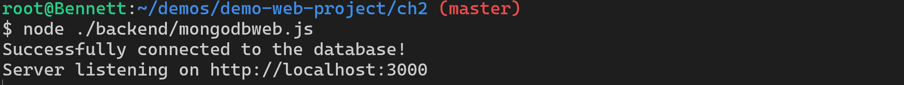
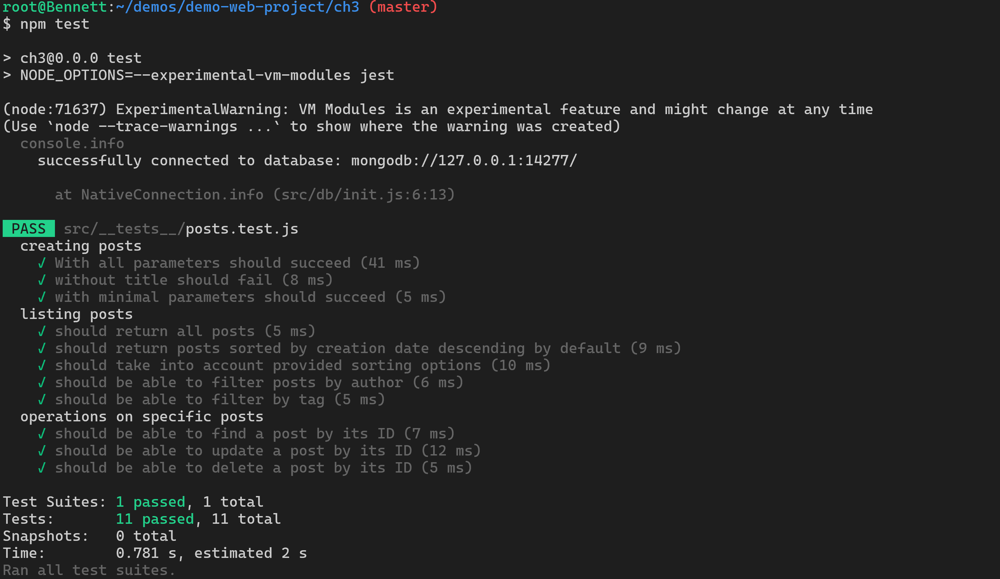
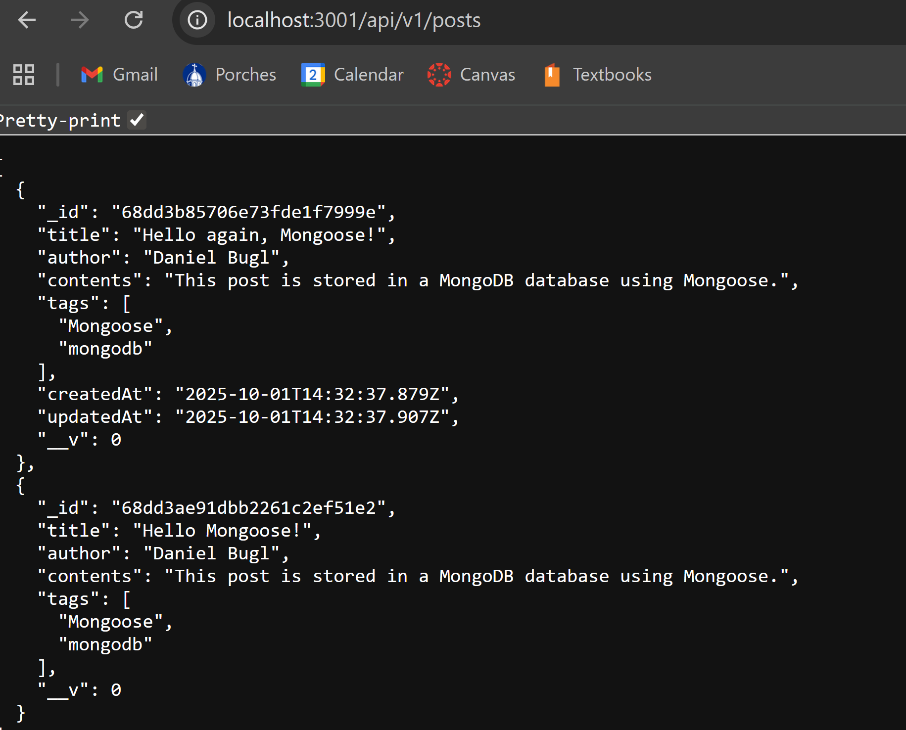
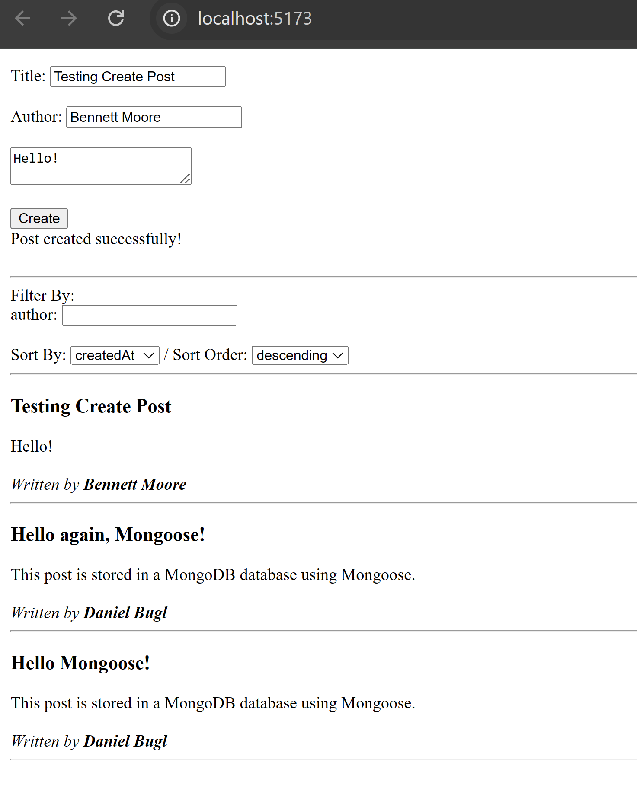
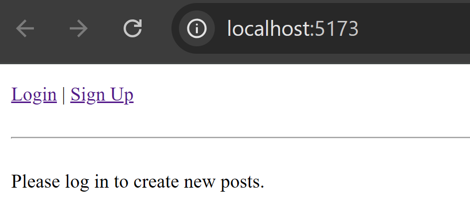
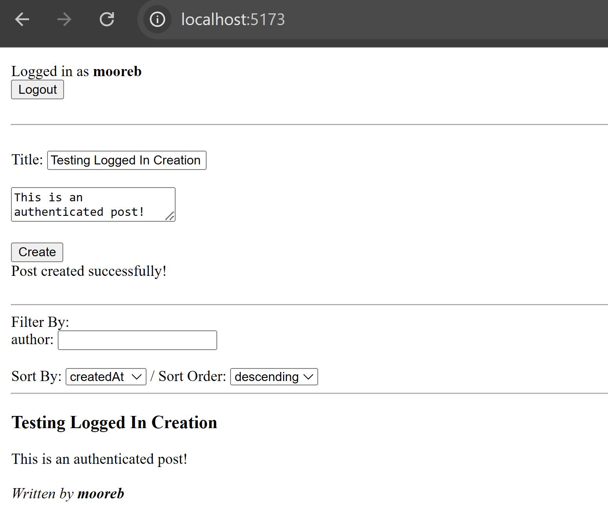
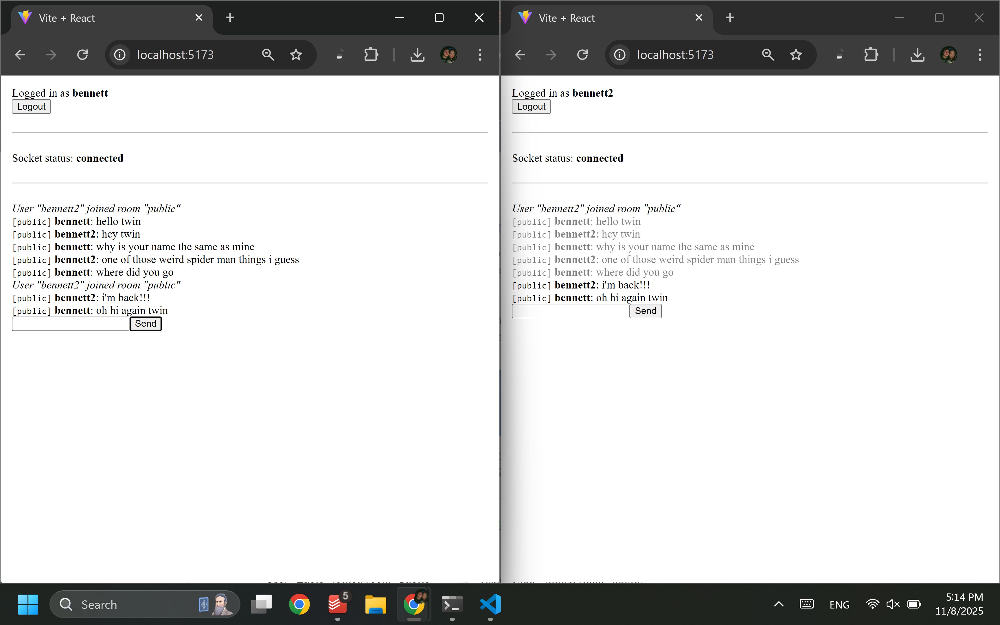

# demo-web-project

This is my work for the tutorials we are going through in class.

## Tutorial Completion Proof

<details><summary>Chapter 2</summary>

_Screenshot of the successful DB connection_



</details>

<details><summary>Chapter 3</summary>

_Screenshot of successful unit test run_



_Screenshot of successful express API request_



</details>

<details><summary>Chapter 4</summary>

_Screenshot of the successful post creation from the frontend_



</details>

<details><summary>Chapter 5</summary>

_Screenshot of requiring a user to log in before creating posts_



_Screenshot of successfully creating an authenticated post_



</details>

<details><summary>Chapter 6</summary>

_Screenshot showing a live chat between two users on the messaging platform_



</details>

## Production Release Notes

The production release is published from a separate Git repo by the following process:

```bash
npm i -g heroku

# Run from root of repo
cp -r production ../
git init
git add .
git commit -m "Initial commit"
heroku git:remote -a mooreb26-test1
git push heroku master
```

This is necessary because the Git repo pushed to Heroku must have all of the contents of the `production` folder at the root of the repo.
